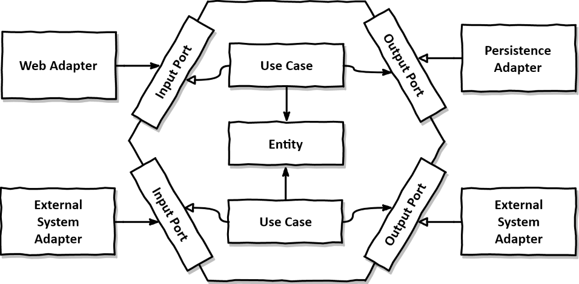

# TiTi Backend

 <br>


## Links

| name          | url                                                                             |
|---------------|---------------------------------------------------------------------------------|
| Tech spec     | https://www.notion.so/timertiti/Tech-Spec-d5333f20b7f440fcaab9ae986fa610ce      |
| API docs      | https://www.notion.so/timertiti/API-Docs-dba28903a8fc4d0d9c49ff686b5ec5f6       |
| Usecase       | https://www.notion.so/timertiti/Usecase-fb15f24e49374bc3934fe3310775a4d4        |
| Ground rules  | https://www.notion.so/timertiti/Ground-Rules-a68119a7e06b42a4afc0b6c5d2390f7d   |
| Secret        | https://www.notion.so/timertiti/Secret-8864c36c5a12468fa0c274b409100721         |
| Infrastrcture | https://www.notion.so/timertiti/Infrastructure-9dbb8941e9364c1fbfbb8712b964471f |

## Getting Started

### Development Environment

- [Open JDK 21](https://openjdk.org/projects/jdk/21/)
- [Spring Boot 3.1.4](https://github.com/spring-projects/spring-boot/releases/tag/v3.1.4)
    - [Spring Framework 6.0.12](https://github.com/spring-projects/spring-framework/releases/tag/v6.0.12)
    - [Spring Data JPA](https://github.com/spring-projects/spring-data-jpa/releases/tag/3.1.4)
        - [Hibernate 6.2.17.Final](https://github.com/hibernate/hibernate-orm/releases/tag/6.2.17)
    - [Spring Data Redis](https://github.com/spring-projects/spring-data-redis/releases/tag/3.1.4)
        - [Lettuce 6.2.6.RELEASE](https://github.com/lettuce-io/lettuce-core/releases/tag/6.2.6.RELEASE)
    - [Spring Security 6.1.4](https://docs.spring.io/spring-security/reference/6.1/index.html)
    - [Spring Mail](https://github.com/spring-projects/spring-boot/releases/tag/v3.1.4)
    - [Spring Oauth2 Client](https://github.com/spring-projects/spring-boot/releases/tag/v3.1.4)
    - [Spring Validation](https://github.com/spring-projects/spring-boot/releases/tag/v3.1.4)
        - [Hibernate Validator 8.0.1.Final](https://github.com/hibernate/hibernate-validator/releases/tag/8.0.1.Final)
    - [Spring Web](https://github.com/spring-projects/spring-boot/releases/tag/v3.1.4)
    - [Spring Test](https://github.com/spring-projects/spring-boot/releases/tag/v3.1.4)
        - [JUnit 5.9.3](https://github.com/junit-team/junit5/releases/tag/r5.9.3)
        - [Mockito 5.3.1](https://github.com/mockito/mockito/releases/tag/v5.3.1)
        - [AssertJ 3.24.2](https://github.com/assertj/assertj/releases/tag/assertj-build-3.24.2)
- [Querydsl 5.0.0](https://github.com/querydsl/querydsl/releases/tag/QUERYDSL_5_0_0)
- [Springdoc 2.3.0](https://github.com/springdoc/springdoc-openapi/releases/tag/v2.3.0)
    - [Swagger UI 5.10.3](https://github.com/swagger-api/swagger-ui/releases/tag/v5.10.3)
- [Mapstruct 1.5.5.Final](https://github.com/mapstruct/mapstruct/releases/tag/1.5.5.Final)
- [jsonwebtoken jjwt 0.12.3](https://github.com/jwtk/jjwt/releases/tag/0.12.3)
- [MySQL 8.0](https://dev.mysql.com/doc/relnotes/mysql/8.0/en/)
- [Gradle 8.5](https://docs.gradle.org/8.5/release-notes.html)

### Setting local environment

```
$ docker-compose up && docker-compose rm -fsv
```

## Project Configuration

### Hexagonal Architecture


```
├── 📂adapter     ▶️ Adapter module that implements specific operations that go outside the system
│     ├── 📂 in
│     └── 📂 out
├── 📂application ▶️ A module that is responsible for domain access and business logic and provides in and out ports
│     ├── 📂 service
│     ├── 📂 in
│     └── 📂 out
└── 📂domain      ▶️ Domain Module
```
### TiTi Architecture

```
└──🔹titi-backend
      ├──📂.github ▶️ Github Template
      ├──📂sql ▶️ TITI DB Schema Management
      ├──📂src/main/java/com/titi
      │     ├── 📂exception ▶️ Exception Package
      │     │     ├── 📂adapter
      │     │     ├── 📂application
      │     │     └── 📂domain
      │     └── 📂infrastructure ▶️ Infrastructure Configuration Package
      │     │     ├── 📂cache
      │     │     └── 📂persistence
      │     └── 📂security ▶️ Security Package
      │     │     ├── 📂authentication
      │     │     ├── 📂config
      │     │     ├── 📂constant
      │     │     └── 📂matcher
      │     └── 📂springdoc ▶️ Springdoc Package
      │     ├── 📂titi_auth ▶️ Authentication/Authorization Module
      │     │     ├── 📂adapter
      │     │     ├── 📂application
      │     │     ├── 📂common
      │     │     ├── 📂data
      │     │     └── 📂domain
      │     ├── 📂titi_common_lib ▶️ Common Library
      │     │     ├── 📂constant
      │     │     ├── 📂dto
      │     │     └── 📂util
      │     ├── 📂titi_crypto_lib ▶️ Crypto Library
      │     │     ├── 📂constant
      │     │     ├── 📂exception
      │     │     └── 📂util
      │     ├── 📂titi_pusher ▶️ Pusher Module
      │     │     ├── 📂adapter
      │     │     ├── 📂application
      │     │     ├── 📂common
      │     │     ├── 📂data
      │     │     └── 📂domain
      │     ├── 📂titi_user ▶️ User Module
      │     │     ├── 📂adapter
      │     │     ├── 📂application
      │     │     ├── 📂common
      │     │     ├── 📂data
      │     │     └── 📂domain
      ├──📄.gitattributes
      ├──📄.gitignore
      ├──🐘build.gradle
      ├──🐳docker-compose.yml ▶️ Script for configuring MySQL local environment
      ├──📄README.md
      ├──🐘settings.gradle
      └──📜titi_formatter.xml ▶️ TiTi Java Code Formatter
```

## Contributors

<table>
  <tr>
    <td align="center">
      <a href="https://github.com/seonpilKim">
        <br />
        <sub><b>seonpilKim</b></sub></a><br />
        <a href="https://github.com/seonpilKim" title="Code">💻</a><br />
        <div>
            前 SKTelecom<br />
            前 Karrotpay<br />
            <b>現 SamsungSDS</b>
        </div>
    </td>
  </tr>
</table>  